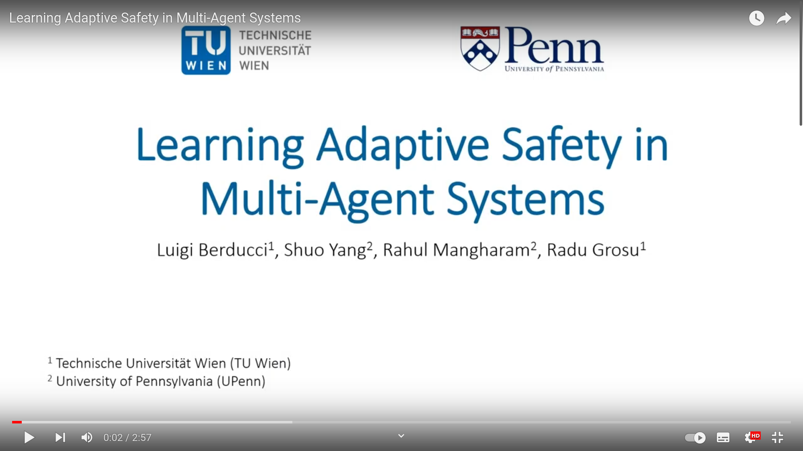
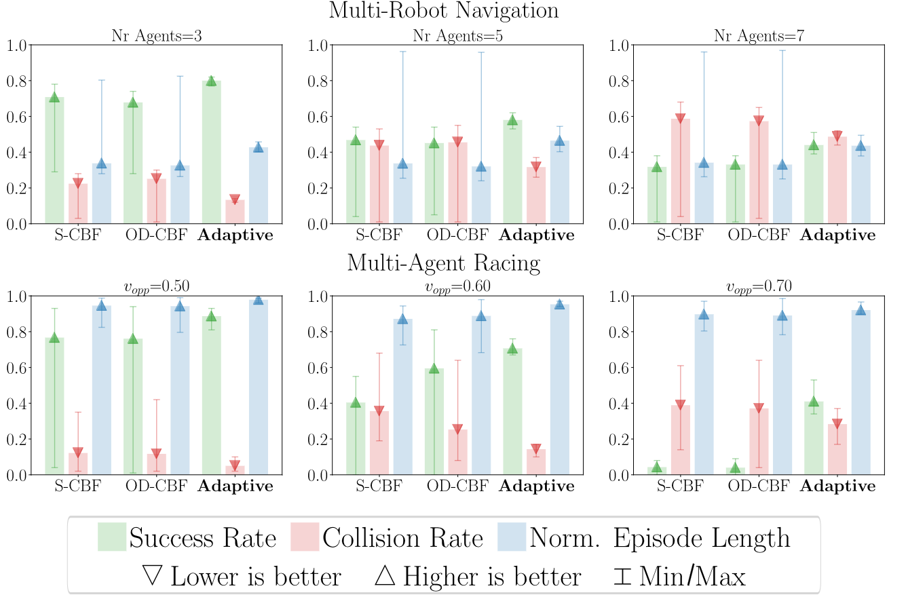

# Learning Adaptive Safety for Multi-Agent Systems

Preprint and supplementary material available [online](https://arxiv.org/abs/2309.10657).


[](https://youtu.be/NDOsWzt1xWo?si=kloCob3V9R_BJRBW)

# Installation

The implementation has been tested with `Python 3.8` under `Ubuntu 20.04`.


# Installation:

1. Clone this repo.
2. Install requirements:
   ```
   pip install -r requirements.txt
   ```
   
## Docker

For better reproducibility, we will release soon a Dockerfile 
to build a container with all the necessary dependencies. :construction_worker:


# Reproducing the Results

We assume that all the experiments are run from the project directory
and that the project directory is added to the `PYTHONPATH` environment variable as follows:
```
export PYTHONPATH=$PYTHONPATH:$(pwd)
```

## Experiment 1 - End-to-End Training


1. For the multi-robot environment, run from the project directory:
```
./script/run_exp_baselines.sh [0-6]
```
where the exp-id `[0-6]` denotes runs with 
`PPOPID`, `PPOLag`, `CPO`, `IPO`, `DDPGLag`, `TD3Lag`, and `PPOSaute` respectively.

2. Similary, For the racing environment, run:
```
./script/run_exp_baselines.sh [7-13]
```

The results will be saved in the `logs/baselines` folder.


## Experiment 2 - Ablation Study



To play with ablate models with adaptive safety, run:
```
./script/run_checkpoint_eval.sh [0-1]
```
where the exp-id `[0-1]` denotes runs for particle-env and racing environments respectively.

<!--
To reproduce the results of Experiment 2, the procedure consists of three steps:
(1) training the adaptive agent, 
(2) evaluating the trained agent and 
(3) evaluating the control-theoretic baselines.

1. To train the adaptive agent, run from the project directory:
```
./script/run_exp_only_adaptive.sh [0-1]
```
where the exp-id `[0-1]` denotes runs on each of the two environments.

The logs will be saved in the `logs/only_adaptive` folder.

2. To evaluate the adaptive agent, adapt the script in `script/run_static_eval.sh`.
For example, for the multi-robot navigation, run the following command:
```
python evaluation/test_different_gammas.py --outdir logs/only_adaptive/evaluations/ \ 
            --n-episodes 100 --checkpoints <path-to-model.pt> \
            --grid-params n_agents=3,5,7 --seed 42 particle-env-v1
```
and for the racing environment:
```
python evaluation/test_different_gammas.py --outdir logs/only_adaptive/evaluations/ \
            --n-episodes 100 --checkpoints <path-to-model.pt> \
            --grid-params vgain=0.5,0.6,0.7 --seed 42 f110-multi-agent-v1
```

This is going to evaluate the checkpoint, collecting 100 episodes for each configuration of parameters.
The logs are stored in the folder `logs/only_adaptive/evaluations/`.

3. To collect simulations with the control-theoretic baselines, run:
```
./script/run_static_eval.sh [0-3]
```
where the exp-id `[0-3]` denotes runs with vanilla CBF and optimal-decay CBF on each of the two environments. 

The same script can be adapted to evaluate checkpoints of the trained models.

The results will be saved in the `logs/static_eval` folder.
-->

# Citation
```
@misc{berducci2023learning,
      title={Learning Adaptive Safety for Multi-Agent Systems}, 
      author={Luigi Berducci and Shuo Yang and Rahul Mangharam and Radu Grosu},
      year={2023},
      eprint={2309.10657},
      archivePrefix={arXiv},
      primaryClass={cs.RO}
}
```
